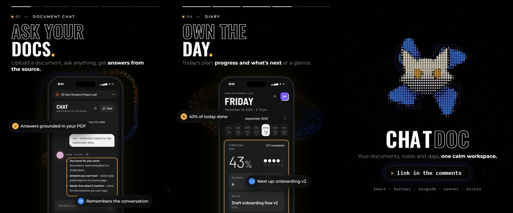
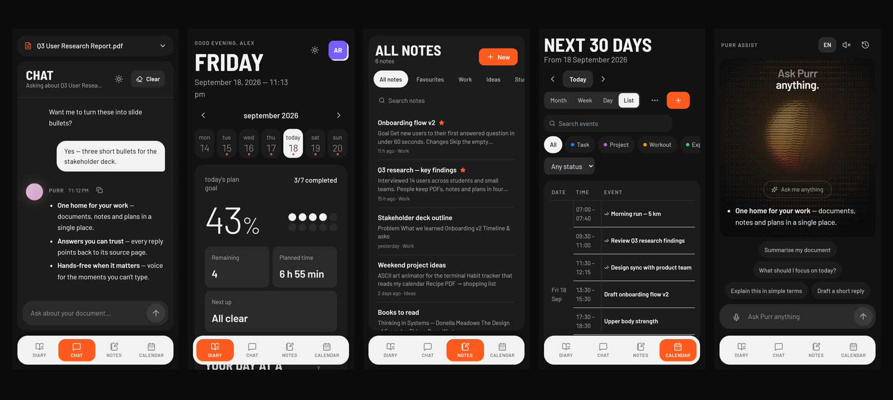
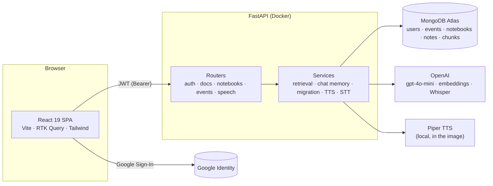
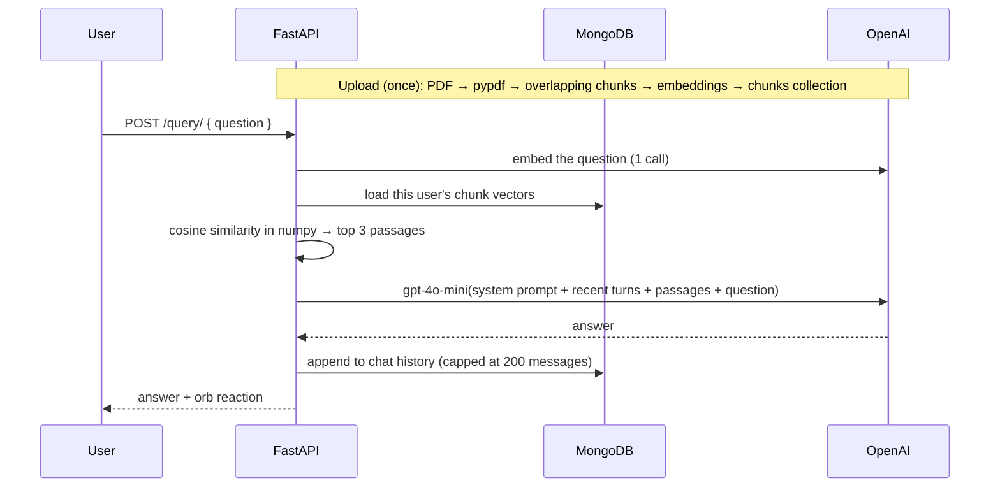

<div align="center">


# ChatDoc · Purr Assist

**An AI workspace for your documents, notes and days.**
Ask questions about a PDF, keep notebooks, plan your week, and talk to a voice assistant — in one calm app.

[](https://github.com/bibkin-maks/AI-productivity-app/actions/workflows/ci.yml)


</div>

<!-- To embed the promo video: open this README on GitHub, click edit, drag
     promo/out/chatdoc-linkedin-sound.mp4 into the editor and paste the resulting link here. -->



---

## What it does

| | |
|---|---|
| **Document chat** | Upload a PDF and ask questions. Answers are grounded in the most relevant passages and the assistant remembers the conversation. |
| **Notes** | Notebooks with a rich-text editor (headings, checklists, tables), favourites, search and drag-to-reorder. |
| **Calendar** | Tasks, projects, workouts and expenses, with recurring events (daily, weekly, custom weekdays, every *n* weeks) and series editing. |
| **Diary** | Today at a glance: progress, timeline, hit list, next up, and the week ahead. |
| **Purr Assist** | A voice assistant: speak or type, hear the answer read back by a local neural voice, with an ASCII orb that reacts to each reply. |



## Architecture



**Asking a question about a PDF**



## Engineering highlights

**Retrieval that doesn't redo work.** An early version rebuilt a FAISS index — re-embedding the *whole PDF* — on every question. Chunks are now embedded once at upload and stored with their vectors; a question costs one embedding call and a cosine-similarity ranking in numpy. At a few hundred chunks per document a vector database would be overhead, and dropping it also removed the deprecated LangChain/FAISS stack.

**A data model that scales, migrated without downtime.** Events, notes and chunks used to live as arrays inside each user's document, growing towards MongoDB's 16 MB limit. They now live in their own indexed collections keyed by `user_id`. Existing users are migrated **lazily and non-destructively** on their first request: copies are idempotent, and the old arrays stay untouched so a deployment still on the old code keeps working during the rollout.

**Security in the details.**
- Google ID tokens are verified server-side; the app issues its own JWT signed with `SECRET_KEY` **plus a per-user secret**, so signing out rotates that secret and revokes every token the user holds.
- Every query is scoped by `user_id`; tests check that one user can't read, edit, move into or delete another user's data.
- Signing secrets never leave the server (a test guards the login response, where one used to leak).
- Rate limits per endpoint (uploads 5/min, questions 30/min), PDF magic-byte and size validation, explicit JWT algorithm, CORS allow-list.

**Bounded conversation memory.** The model sees the last 8 exchanges within a ~1.5k-token budget, with long messages truncated, so a pasted wall of text can't crowd out the conversation — and cost stays predictable.

**Voice with graceful fallbacks.** Speech-to-text uses the browser's Web Speech API and falls back to recording + Whisper when the browser's service fails. Answers are read by [Piper](https://github.com/rhasspy/piper) neural voices running locally inside the backend image (no per-request cost); without them the browser's own voice is used.

**Front-end craft.** A Three.js particle field that morphs between shapes as you scroll (custom shaders, cursor repulsion, `prefers-reduced-motion` respected), an ASCII-rendered orb and logo, RTK Query caching, and a small design system shared by all signed-in pages.

**Tested and shipped like a product.** 35 backend tests run against an in-memory MongoDB with OpenAI and Google replaced by deterministic fakes — they take under a second and never touch real services. GitHub Actions lints and tests both halves and builds both Docker images on every push; the whole stack starts with one command.

**Even the promo video is code.** The launch video was produced by a pipeline in [`promo/`](promo): Playwright captures the real app frame-by-frame under a fake clock, an HTML/Web-Animations overlay adds titles and the ASCII logo, and a Python script composes and mixes the soundtrack (SoundFont instruments + Spotify's Pedalboard), locked to the edit at 109 BPM so every cut lands on a downbeat.

## Tech stack

| Layer | Tools |
|---|---|
| Frontend | React 19, Vite 6, React Router 7, Redux Toolkit + RTK Query, Tailwind CSS, Framer Motion, Three.js, Tiptap, react-big-calendar |
| Backend | Python 3.11, FastAPI, Pydantic, Motor (async MongoDB), python-jose, slowapi, pypdf |
| AI | OpenAI `gpt-4o-mini` (chat), `text-embedding-3-small` (retrieval), Whisper (speech-to-text), Piper (local TTS) |
| Data | MongoDB Atlas |
| Tooling | Docker + nginx, GitHub Actions, pytest + mongomock-motor, Ruff, ESLint |
| Hosting | Vercel (frontend), Render (backend) |

## Run it locally

You need Docker, a MongoDB connection string, an OpenAI API key and a Google OAuth client ID.

```bash
git clone https://github.com/bibkin-maks/AI-productivity-app.git
cd AI-productivity-app
cp backend/.env.example backend/.env    # fill in the keys
docker compose up --build
```

Open **http://localhost:5173** (API on http://localhost:8000). The first build downloads the Piper voices (~180 MB); skip them with `WITH_VOICES=false docker compose up --build`.

<details>
<summary>Without Docker</summary>

```bash
# backend
cd backend
python -m venv .venv && . .venv/bin/activate      # Windows: .venv\Scripts\activate
pip install -r requirements.txt
python run_app.py                                 # http://localhost:8000

# frontend (second terminal)
cd frontend
cp .env.example .env
npm install
npm run dev                                       # http://localhost:5173
```
</details>

## Tests

```bash
cd backend
pip install -r requirements-dev.txt
pytest          # 35 tests, < 1 s
ruff check app tests
```

```bash
cd frontend
npm run lint && npm run build
```

## Project structure

```
backend/
  app/
    routers/     auth · docs · notebooks · events · speech
    services/    ai · retrieval · context (chat memory) · migration · users · pdf · speech · transcribe · orb
    core/        settings, JWT + Google verification, rate limiter
    db/          Motor client and indexes
  tests/         API tests on an in-memory MongoDB
frontend/
  src/
    pages/       one file per route
    components/  home (particles) · landing · app shell · calendar · diary · notes · purr (ASCII orb)
    slices/      RTK Query API + auth/calendar state
promo/           code that produced the launch video
.github/         CI workflow
```

## What I'd build next

- **Several documents per user**, with citations that link to the page an answer came from.
- **Streaming answers** (server-sent events) so long replies appear as they're written.
- **A local-first mode** — a local model via Ollama alongside the local voices, so nothing leaves the machine.
- **End-to-end tests** with Playwright for the main flows (the capture tooling in `promo/` is most of the way there).
- **Field-level encryption** for note and chat content, and dropping the legacy arrays once every deployment runs schema 2.

## Author

**bibkin-maks** — [GitHub](https://github.com/bibkin-maks)

Released under the [MIT License](LICENSE).
